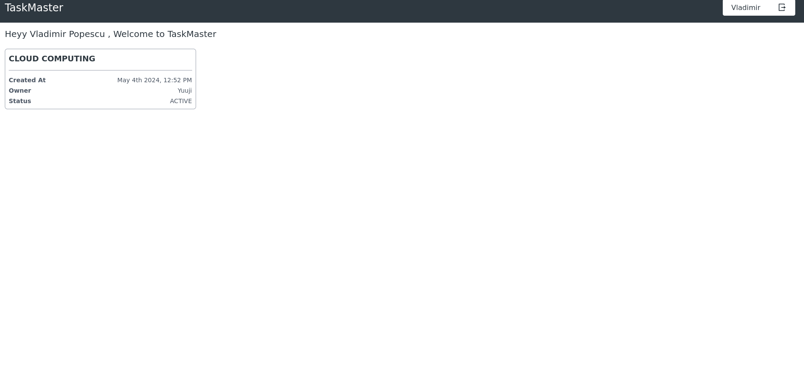

# cloud-computin-project

cloud computing project

Proiect realizat de Eugen-Alexandru Meran

1. Acest proiect foloseste ca tehnologii MERN stack(MONGODB, EXPRESSJS, REACT, NODE) si reprezinta o aplicatie in care se manageuiesc task-uri, asemanator cu aplicatii precum Jira, Trello, dar mai lightweight.

2. Problema pe care o rezolva aplicatia consta in capacitatea managerilor de a putea mentine tracking asupra task-urilor si a putea verifica statusul task-urilor assignate in real-time.

Aplicatia contine 3 tipuri de actori(useri):
Project owner - Cel care creeaza proiectul si are capacitatea de a adauga useri. De asemenea, acesta are si drepturile rolului de admin.
Admin - Acest rol este dat de project owner cu scopul de a creea task-uri si a le assigna userilor din proiect, acestea poate modifica task-urile din orice punct de vedere cand doreste.
Employee - Acest rol este cel mai jos din punct de vedere ale drepturilor de utilizare, acesta avand capacitatea doar sa modifice statusul task-urilor assignate lui.

3. Aplicatia foloseste MONGODB ca baza de date, o baza de date non relationala cu scopul de a avea cat mai multa flexibilitatea in managementul entitatilor, aplicatia continand 3 entitati:
   PROJECT,
   TASK
   USER
   si o entitate suplimentara MEMBER folosita ca o entitate intermediara.

Pe baza acestor entitati, apelam diverse API-uri de POST, PUT, GET, DELETE pentru a face diverse modificari in baza de date a aplicatiei, in legatura cu proiectele, task-urile si userii din proiect. De asemenea, cu ajutorul serviciul de Cloudinary, putem accesa imagini assignate task-urilor la descrieri, pe baza listei de url-uri din entitate.

4. In fluxul de date, apelam prin protocolul HTTP diverse tipuri de API-uri.

Pentru task-uri si pentru useri, avem cate un POST REQUEST, de exemplu:

localhost:5000/create-project POST
cu request body-ul:

{
  "name": "new project",
  "description": "New project for university",
  "owner": "6636053d4b06716446fd1b74",
  "members": [
    {
      "user": "6636053d4b06716446fd1b74",
      "role": "owner"
    }
  ]
}

si response body-ul: 

{
  "success": true,
  "data": {
    "name": "new project",
    "description": "New project for university",
    "status": "active",
    "owner": "6636053d4b06716446fd1b74",
    "members": [
      {
        "user": "6636053d4b06716446fd1b74",
        "role": "owner",
        "_id": "66361054972e116455194696"
      }
    ],
    "_id": "66361054972e116455194695",
    "createdAt": "2024-05-04T10:39:16.931Z",
    "updatedAt": "2024-05-04T10:39:16.931Z",
    "__v": 0
  },
  "message": "Project created successfully"
}

si pentru task de asemenea:
localhost:5000/create-task POST

{
  "name": "create new proof of concept",
  "description": "Make proof of concept for the new project",
  "assignedTo": "663604374b06716446fd1b33",
  "project": "66361054972e116455194695",
  "assignedBy": "6636053d4b06716446fd1b74"
}

{
  "success": true,
  "message": "Task created successfully",
  "data": {
    "name": "create new proof of concept",
    "description": "Make proof of concept for the new project",
    "status": "pending",
    "project": "66361054972e116455194695",
    "assignedTo": "663604374b06716446fd1b33",
    "assignedBy": "6636053d4b06716446fd1b74",
    "attachments": [],
    "_id": "663610fa972e1164551946b0",
    "createdAt": "2024-05-04T10:42:02.784Z",
    "updatedAt": "2024-05-04T10:42:02.784Z",
    "__v": 0
  }
}

Aplicatia foloseste clasicul JWT token pentru autentificare, nu foloseste servicii cloud pentru acest flow.

De asemenea, folosim si metode de tip GET

localhost:5000/get-logged-in-user GET

pentru a extrage user logat curent in sesiunea respectiva

raspunsul fiind:

{
"_id": "6636053d4b06716446fd1b74",
"firstName": "Vladimir",
"lastName": "Popescu",
"email": "vladimir@mail.com",
"createdAt": "2024-05-04T09:51:57.960Z",
"updatedAt": "2024-05-04T09:51:57.960Z",
}

De asemnea, aplicatia foloseste 3 SERVICII cloud: 

1. Foloseste atlas DB pentru a stoca remote baza de date MongoDB in clustere remote.

2. Foloseste Cloudinary, pentru a stoca in cloud imaginile din detalii task-urilor, pe baza listei de url-uri din entitatea de TASK, care este identificata ca field-ul *attachments* in schema de mongoose: 

const taskSchema = new mongoose.Schema(
    {
        name: {
            type: String,
            required: true,
        },
        description: {
            type: String,
            required: true,
        },
        status: {
            type: String,
            required: true,
            default: "pending",
        },
        project: {
            type: mongoose.Schema.Types.ObjectId,
            ref: "projects",
        },
        assignedTo: {
            type: mongoose.Schema.Types.ObjectId,
            ref: "users",
        },
        assignedBy: {
            type: mongoose.Schema.Types.ObjectId,
            ref: "users",
        },
        attachments: {
            type: Array,
            default : []
        },
    },
    { timestamps: true }
);

3. Aplicatia este deployed pe render si poate fi accesata pe baza url-ului: 
https://cloud-computin-project-1.onrender.com/login

Aceasta avand deployed si backend-ul si front-end-ul.

5. Capturi ecran aplicatie:

 

 6. Referinte: 

 https://cloud.mongodb.com
 https://cloudinary.com/
 https://render.com/
 https://react.dev/
 https://www.npmjs.com/
 https://mongoosejs.com/

 
